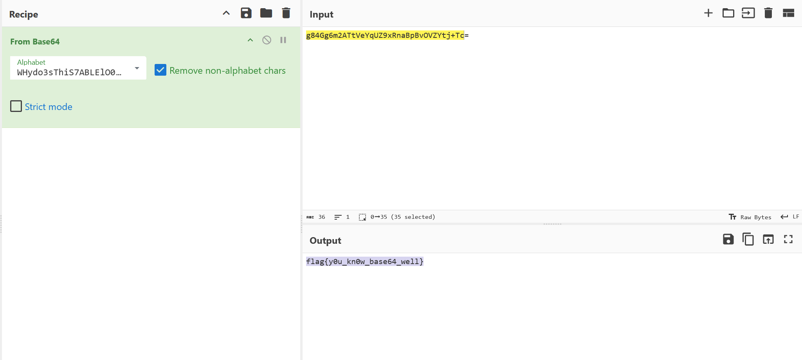

# before the writeup
> 题目感谢西电提供的平台，平台链接如下
[西电训练平台](https://ctf.xidian.edu.cn)
# week 1
## crypto
### base
```
4C4A575851324332474E324547554B494A5A4446513653434E564D444154545A4B354D45454D434E4959345536544B474D5134513D3D3D3D
```
base32->
> ZmxhZ3tCQHNFXzBmX0NyWXB0MF9OMFd9

base64->
> flag{B@sE_0f_CrYpt0_N0W}
### Strange King
>ksjr{EcxvpdErSvcDgdgEzxqjql}
刚开始试的凯撒，发现找不到，仔细观察发现ksjr和flag的偏移量是5 7 9 11 ，于是猜测后续就是13 15这样，于是写个脚本，注意mod 26
```python
def dec(cipher,i,li):
    if(cipher[i]>='a'and cipher[i]<='z'):
        return chr((ord(cipher[i])+((-li[i])%26)-ord('a'))%26+ord('a'))
    elif(cipher[i]>='A'and cipher[i]<='Z'):
        return chr((ord(cipher[i])+((-li[i])%26)-ord('A'))%26+ord('A'))
    else :
        return cipher[i]
cipher="ksjr{EcxvpdErSvcDgdgEzxqjql}"
# print(ord('k')-ord('f'))
# print(ord('s')-ord('l'))
# print(ord('j')-ord('a'))
# print(ord('r')-ord('g'))
# print(chr(ord('E')+((-15)%26)))
li=[]
IV=5
for i in range(len(cipher)):
    li.append(IV)
    IV+=2
flag=""
for i in range(len(cipher)):
    flag+=dec(cipher,i,li)
print(flag)
```
> flag{PleaseDoNotStopLearing}

### xor
题目
```python
#As a freshman starting in 2024, you should know something about XOR, so this task is for you to sign in.

from pwn import xor
#The Python pwntools library has a convenient xor() function that can XOR together data of different types and lengths
from Crypto.Util.number import *

key = b'New_Star_CTF'
flag='flag{*******************}'

m1 = bytes_to_long(bytes(flag[:13], encoding='utf-8'))
m2 = flag[13:]

c1 = m1 ^ bytes_to_long(key)
c2 = xor(key, m2)
print('c1=',c1)
print('c2=',c2)
# c1= 8091799978721254458294926060841
# c2= b';:\x1c1<\x03>*\x10\x11u;'
```
脚本
```python
c1= 8091799978721254458294926060841
c2= b';:\x1c1<\x03>*\x10\x11u;'

m1=c1^bytes_to_long(key)
m2=xor(key,c2)
print(long_to_bytes(m1))
print(m2)
print(long_to_bytes(m1).decode()+m2.decode())
```
> flag{0ops!_you_know_XOR!}

### 一眼秒了
```python
from Crypto.Util.number import *
from gmpy2 import *
from serct import flag
p = getPrime(512)
q = getPrime(512)
n = p*q
m = bytes_to_long(flag)
e = 65537
c = powmod(m, e, n)
print(n)
print(c)

from Crypto.Util.number import *
# 52147017298260357180329101776864095134806848020663558064141648200366079331962132411967917697877875277103045755972006084078559453777291403087575061382674872573336431876500128247133861957730154418461680506403680189755399752882558438393107151815794295272358955300914752523377417192504702798450787430403387076153
#c=48757373363225981717076130816529380470563968650367175499612268073517990636849798038662283440350470812898424299904371831068541394247432423751879457624606194334196130444478878533092854342610288522236409554286954091860638388043037601371807379269588474814290382239910358697485110591812060488786552463208464541069
```
扔进factordb中秒了分解，然后套公式
```python
from Crypto.Util.number import *
# 52147017298260357180329101776864095134806848020663558064141648200366079331962132411967917697877875277103045755972006084078559453777291403087575061382674872573336431876500128247133861957730154418461680506403680189755399752882558438393107151815794295272358955300914752523377417192504702798450787430403387076153
c=48757373363225981717076130816529380470563968650367175499612268073517990636849798038662283440350470812898424299904371831068541394247432423751879457624606194334196130444478878533092854342610288522236409554286954091860638388043037601371807379269588474814290382239910358697485110591812060488786552463208464541069
p=7221289171488727827673517139597844534869368289455419695964957239047692699919030405800116133805855968123601433247022090070114331842771417566928809956044421
q=7221289171488727827673517139597844534869368289455419695964957239047692699919030405800116133805855968123601433247022090070114331842771417566928809956045093
e=0x10001
phi=(p-1)*(q-1)
d=inverse(e,phi)
print(long_to_bytes(pow(c,d,p*q)))
```
> flag{9cd4b35a-affc-422a-9862-58e1cc3ff8d2}

## misc
### Labyrinth

> https://aperisolve.com


一把梭

> flag{e33bb7a1-ac94-4d15-8ff7-fd8c88547b43}
### WhereIsFlag

在proc中找到了
> flag{nEW5T4R_cTF_20242e2c752e8737}

### pleasingMusic
根据提示，将其反过来就可以了，然后看音轨，对应morse电码
> · --·· ··--·- -- --- ·-· ··· · ··--·- -·-· --- -·· ·
 
> EZ_MORSE_CODE

> flag{EZ_MORSE_CODE}
### 兑换码
> C:\Program Files\Java\jdk-22\bin>java -jar "C:\Program Files\Stegsolve.jar"
失败
修改长宽高试试，得到flag

> flag{La_vaguelette}

## re
### Simple_encryption

非常简单，写个脚本秒了
```python
def res(a,i):
    if(i%3==0):
        return a+31
    elif(i%3==1):
        return a-41
    elif(i%3==2):
        return a^0x55
    else :
        return 0
text=[]

buffer=[0x47, 0x95, 0x34, 0x48, 0xA4, 0x1C, 0x35, 0x88, 0x64, 0x16, 0x88, 0x07, 0x14, 0x6A, 0x39, 0x12, 0xA2, 0x0A, 0x37, 0x5C, 0x07, 0x5A, 0x56, 0x60, 0x12, 0x76, 0x25, 0x12, 0x8E, 0x28]
for i in range (len(buffer)):
    text.append(res(buffer[i],i))

flag=""
for i in range(len(text)):
    flag+=chr((text[i]))
print(flag)
```
> flag{IT_15_R3Al1y_V3Ry-51Mp1e}
### base64

换表base64，秒了

> flag{y0u_kn0w_base64_well}

### begin
非常好的题目，教人如何用IDA
告诉我们 shift+F12可以查看string，而变量或者函数加x可以看到引用
> flag{Mak3_aN_3Ff0rt_tO_5eArcH_F0r_th3_f14g_C0Rpse}

## pwn
### game
源代码的意思是每次输入一个个位数，五秒内输到大于999即可，exp如下
```python
from pwn import *
p=remote('127.0.0.1',45393)
#p=process("./pwn")
context.log_level='DEBUG'
for i in range(112):
    
    p.sendline(b"9")
p.interactive()

```
### real login
真的是签到，输入NewStar!!!就可以拿shell